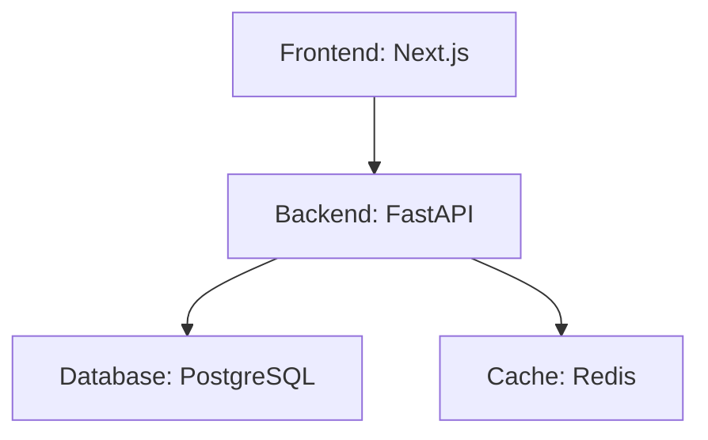

# ArchSketch

A Python CLI tool that scans any project directory and automatically infers its system architecture from common project files, then displays a beautiful ASCII diagram in your terminal.

**No configuration needed.** Just point it at a folder.

## Quick Start

```bash
# Clone the repo
git clone https://github.com/yourusername/archsketch.git
cd archsketch

# Set up Python environment
python -m venv venv

# Activate (Windows)
venv\Scripts\activate

# Activate (macOS/Linux)
source venv/bin/activate

# Install
pip install -e .

# Run on any project!
archsketch analyze /path/to/your/project
```

## Example Output

```
                          ARCHITECTURE SKETCH

                    +--------------------------+
                    |     >> Reverse Proxy     |
                    |          Nginx           |
                    +--------------------------+
                                 |
                                 v
                    +--------------------------+
                    |       ## Frontend        |
                    |         Next.js          |
                    +--------------------------+
                                 |
                                 v
                    +--------------------------+
                    |       @@ Backend         |
                    |         FastAPI          |
                    +--------------------------+
                          |            |
                          v            v
              +----------------+ +----------------+
              |   [] Database  | |    <> Cache   |
              |   PostgreSQL   | |     Redis     |
              +----------------+ +----------------+

+------------------------ Legend -------------------------+
|  ## Frontend | @@ Backend | [] Database | <> Cache | >> Proxy |
+---------------------------------------------------------+
```

## Usage

### Analyze any project

```bash
archsketch analyze .                           # Current directory
archsketch analyze /path/to/your/project       # Any project folder
archsketch analyze ~/code/my-app               # Home directory path
archsketch analyze . --compact                 # Diagram only, no detections table
archsketch analyze . --no-table                # Same as --compact
```

### Export to Mermaid

```bash
archsketch export /path/to/project --format mermaid --output architecture.mmd
```

### Export to SVG (shareable image)

```bash
# Requires: pip install graphviz AND Graphviz binaries (https://graphviz.org/download/)
archsketch export . --format graphviz --output architecture.svg

# Or export DOT file (no binary needed), then convert: dot -Tsvg architecture.dot -o architecture.svg
archsketch export . --format dot --output architecture.dot
```

Generates:



### JSON output

```bash
archsketch analyze /path/to/project --json
```

### Show Mermaid in terminal

```bash
archsketch show /path/to/project
```

## What It Detects

ArchSketch reads these files to understand your stack:

| File | What it detects |
|------|----------------|
| `package.json` | React, Next.js, Vue, Express, NestJS, Prisma, Redis clients |
| `requirements.txt` | FastAPI, Flask, Django, Celery, psycopg2, redis-py |
| `pyproject.toml` | Same as requirements.txt |
| `docker-compose.yml` | PostgreSQL, MySQL, Redis, Nginx, RabbitMQ, custom services |
| `Dockerfile` | Base images (node, python, nginx) |
| `.env` | Database URLs, Redis URLs, service connections |

## Detected Technologies

| Role | Technologies |
|------|-------------|
| **Frontend** | React, Next.js, Vue.js, Nuxt.js, Angular, Svelte, **Remix**, **Astro**, **SolidJS**, **Qwik**, Preact |
| **Backend** | Express, NestJS, FastAPI, Flask, Django, Fastify, **Hono**, **Elysia**, **Spring Boot** (pom.xml), Micronaut, Quarkus |
| **Database** | PostgreSQL, MySQL, MongoDB, SQLite, **Supabase** |
| **Cache** | Redis, Memcached |
| **Reverse Proxy** | Nginx, Traefik, Caddy |
| **Worker** | Celery, Bull, RQ |
| **Queue** | RabbitMQ, Kafka |

## How It Works

```
Your Project          ArchSketch Pipeline              Output
    │                        │                           │
    ├─ package.json    ──►   │                           │
    ├─ requirements.txt ──►  │  1. Scan files            │
    ├─ docker-compose.yml ►  │  2. Detect technologies   │  ──► ASCII Diagram
    ├─ Dockerfile      ──►   │  3. Infer relationships   │  ──► Mermaid Export
    └─ .env            ──►   │  4. Build graph           │  ──► JSON Data
                             │  5. Render                 │
```

1. **Scanner** - Walks your project, finds architecture-related files
2. **Detectors** - Parse each file type, extract technology signals
3. **Inference Engine** - Apply rules to determine roles and connections
4. **Renderer** - Output as ASCII art or Mermaid diagram

## Try It On Popular Projects

```bash
# Clone any open source project and analyze it
git clone https://github.com/tiangolo/full-stack-fastapi-template
archsketch analyze full-stack-fastapi-template

# Or your own projects
archsketch analyze ~/code/my-saas-app
```

## Development

### Run tests

```bash
pip install -e ".[dev]"
pytest
```

### Project structure

```
archsketch/
├── archsketch/
│   ├── main.py              # CLI commands
│   ├── scanner.py           # File discovery
│   ├── models.py            # Data structures
│   ├── detectors/           # Technology detection
│   │   ├── package_json.py
│   │   ├── requirements_txt.py
│   │   ├── docker_compose.py
│   │   └── dockerfile.py
│   ├── inference/
│   │   └── engine.py        # Architecture inference rules
│   └── renderers/
│       ├── ascii_renderer.py
│       └── mermaid_renderer.py
├── tests/                   # 40 tests
├── samples/                 # Example projects
└── pyproject.toml
```

## Requirements

- Python 3.9+
- No external services needed
- Works offline

## License

MIT
