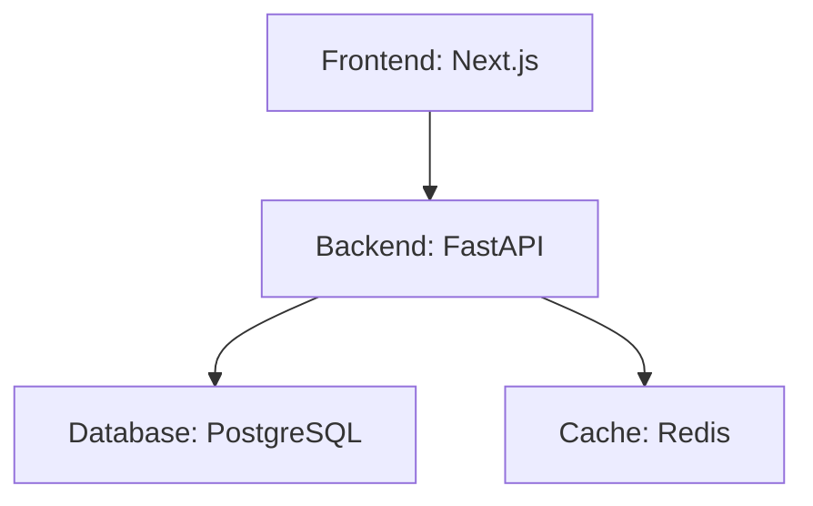

# ArchSketch

A Python CLI tool that scans a project directory and infers a high-level system architecture from common project files, then prints an ASCII architecture sketch in the terminal and exports a Mermaid diagram.

## Features

- **Scan** project folders for architecture-related files
- **Detect** common technologies (React, Next.js, Express, FastAPI, Django, PostgreSQL, Redis, etc.)
- **Infer** architecture roles (frontend, backend, database, cache, reverse proxy, worker)
- **Render** ASCII architecture sketches in the terminal
- **Export** Mermaid diagrams for documentation

## Installation

```bash
# Clone the repository
git clone https://github.com/yourusername/archsketch.git
cd archsketch

# Create virtual environment
python -m venv venv

# Activate virtual environment
# On Windows:
venv\Scripts\activate
# On macOS/Linux:
source venv/bin/activate

# Install in development mode
pip install -e ".[dev]"
```

## Usage

### Analyze a project

```bash
archsketch analyze /path/to/your/project
```

Example output:

```text
╭─────────────────────────────────────────────╮
│           Architecture Sketch               │
╰─────────────────────────────────────────────╯

[Frontend: Next.js] ──> [Backend: FastAPI] ──> [Database: PostgreSQL]
                                          └──> [Cache: Redis]
```

### Export to Mermaid

```bash
archsketch export /path/to/your/project --format mermaid --output architecture.mmd
```

This generates a Mermaid file:



## Detected Technologies

### Frontend
- React
- Next.js
- Vue.js
- Angular

### Backend
- Express.js
- NestJS
- FastAPI
- Flask
- Django

### Database
- PostgreSQL
- MySQL
- MongoDB
- SQLite

### Cache
- Redis
- Memcached

### Infrastructure
- Nginx (reverse proxy)
- Docker / Docker Compose
- Celery (worker)

## How It Works

1. **Scanner**: Walks the project directory and collects important files (package.json, requirements.txt, docker-compose.yml, etc.)
2. **Detectors**: Parse each file type and extract technology signals
3. **Inference Engine**: Apply rules to determine architecture roles and relationships
4. **Renderers**: Output the architecture as ASCII or Mermaid

## Development

### Running Tests

```bash
pytest
```

### Project Structure

```
archsketch/
├── archsketch/
│   ├── __init__.py
│   ├── main.py           # CLI entry point
│   ├── scanner.py        # File discovery
│   ├── models.py         # Data structures
│   ├── detectors/        # Technology detection
│   │   ├── package_json.py
│   │   ├── requirements_txt.py
│   │   ├── docker_compose.py
│   │   ├── dockerfile.py
│   │   └── env_files.py
│   ├── inference/        # Architecture inference
│   │   └── engine.py
│   └── renderers/        # Output formats
│       ├── ascii_renderer.py
│       └── mermaid_renderer.py
├── tests/
├── pyproject.toml
└── README.md
```

## License

MIT
